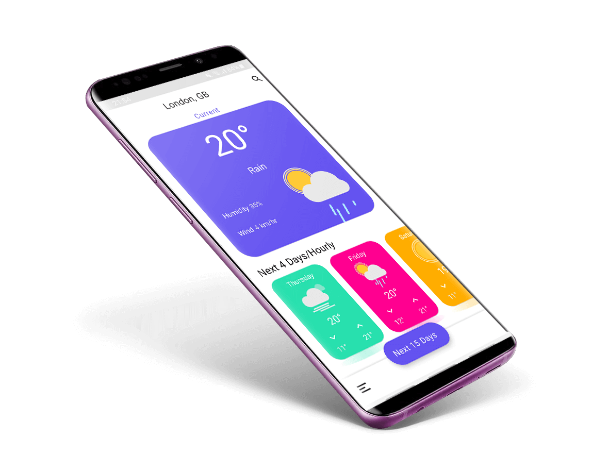
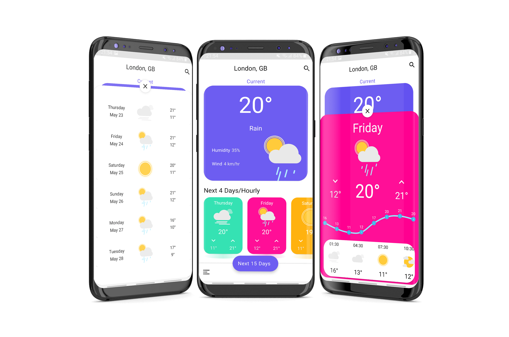

# Android Weather App — OpenWeatherMap, Material Design & Offline Data

[](https://developer.android.com/)
[](https://developer.android.com/)
[](LICENSE)
[](https://github.com/AlakhiarovSalekh/Weather-App/stargazers)

A native Android weather application using OpenWeatherMap data, Material Design components, local persistence, dark mode, charts, search, and multilingual UI.

<p align="center">
  
</p>

## Highlights

- OpenWeatherMap API integration
- Material Design 2 interface
- Dark mode
- English and Persian language support
- Local database support
- Weather charts and visualizations
- Search experience
- Android API level 21+
- Release build available from the repository releases page

## Screenshots

<p align="center">
  
</p>

## Requirements

- Android Studio
- JDK 17
- Android SDK 34
- Android API level 21 or newer

## Tech Stack

- AndroidX: AppCompat, RecyclerView, ConstraintLayout
- Material Components
- Retrofit, OkHttp, Logging Interceptor
- ObjectBox
- RxAndroid
- Glide
- Lottie Android
- MaterialSearchView
- MPAndroidChart
- Firebase / Crashlytics

## Getting Started

Clone the repository:

```bash
git clone https://github.com/AlakhiarovSalekh/Weather-App.git
```

Open the project in Android Studio, let Gradle resolve dependencies, configure the weather API credentials expected by the project, and run it on an emulator or Android device.

## Release

Prebuilt releases, when available, are published under [GitHub Releases](https://github.com/AlakhiarovSalekh/Weather-App/releases).

## Design Credit

The interface was inspired by the [Weather App Freebie](https://www.uplabs.com/posts/weather-app-freebie) concept by [Raman Yv](https://www.uplabs.com/ramandesigns9).

## Contributing

Focused bug fixes, documentation improvements, dependency maintenance, and UI/accessibility improvements are welcome through pull requests.

## More Projects by Salekh

- [Notes App](https://github.com/AlakhiarovSalekh/Notes-App) — Kotlin, Jetpack Compose, Room, Hilt, and Clean Architecture.
- [Lector](https://github.com/AlakhiarovSalekh/Lector) — private offline Android document reader with text-to-speech.
- [Android Kotlin Bluetooth Chat App](https://github.com/AlakhiarovSalekh/Android-Kotlin-Bluetooth-Chat-App) — Bluetooth device-to-device chat.

## Author

**Salekh Alakhiarov** · [GitHub](https://github.com/AlakhiarovSalekh)

## License

Licensed under the Apache License 2.0. See [LICENSE](LICENSE).
